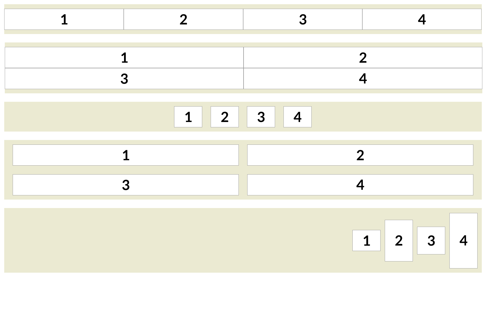

# Exercice flexbox 2

## Installation

1. Cloner le repository
2. Ouvrir le dossier avec Visual Studio Code
3. Ouvrir une fenêtre de terminal dans Visual Studio Code et entrer la commande suivante :

```bash
npm install
```

## Travail

Depuis le terminal, entrer la commande suivante :

```bash
npm run dev
```

## Consigne

1. Ouvrir [la maquette Figma](https://www.figma.com/design/4SmW0XsGSgzK1WMulmF0ST/imd2-exercice-flexbox-2?node-id=0-2&t=WfUS5RCoKeAndeXK-1) dans l'équipe de votre année
2. Intégrer la maquette en utilisant les propriétés flexbox et **sans modifier le HTML**.
3. Faire un commit, puis un push

## Aperçu de la maquette


